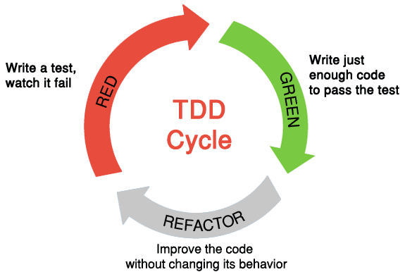

:figure-caption!:
:tocs!:

## Zaczynamy 3.10.2019 🚀

[quote, Edsger W. Dijkstra, On the cruelty of really teaching computer science]
____
*The usual way in which we plan today for tomorrow is in yesterday's vocabulary.*
We do so, because we try to get away with the concepts we are familiar with and
that have acquired their meanings in our past experience. Of course, the words
and the concepts don't quite fit because our future differs from our past, but
then we stretch them a little bit.
____

* Zaczynamy od przeczytania/przejrzenia
  https://github.com/uohzxela/clean-code-ruby[🛁 Clean Code concepts adapted for Ruby]. +

* Na wykładzie wyjaśnimy dokładniej niektóre z opisanych powyżej
  [red]#**zaawansowanych**# rzeczy. Na przykład rozszyfrujemy skrótowiec SOLID,
  omówimy różne *refaktoryzacje* oraz zajmiemy się usuwaniem _code smells_.

* https://www.sandimetz.com/products[Literatura] – na początek wystarczą nam
  dwie książki Sandi Metz i jej prezentacja z YouTube:
** https://www.youtube.com/watch?v=mpA2F1In41w[Go Ahead, Make a Mess]; zob. też
  Joe Armstrong, one of the inventors of Erlang, https://www.youtube.com/watch?v=lKXe3HUG2l4[The Mess We're In].

## https://github.com/egzamin/slides[Slajdy do wykładu]

## TDD Cycle (Loop)

.Źródło: https://r-stylelab.com/company/blog/web-development/from-tdd-to-bdd-when-to-switch-and-how-to-apply[From TDD to BDD: When to Switch and How to Apply]

## Note about Ruby language from Sandi Metz

**Ruby is very friendly.**
The language permits nearly anyone to create scripts to automate repetitive
tasks, and an opinionated framework like _Ruby on Rails_ puts web applications
within every programmer’s reach.

The syntax of the Ruby language is so gentle that anyone blessed with the
ability to string thoughts into logical order can produce working applications.
**Programmers who know nothing about object-oriented design can be very successful in Ruby.**

## Egzamin – prezentacje projektów (TODO)

**Na każdą prezentację przeznaczone jest co najwyżej 15 min.**

W trakcie prezentacji należy omówić refaktoryzację przykładowego
kodu. Można się wzorować na wykładzie Katriny Owen,
https://www.youtube.com/watch?v=J4dlF0kcThQ[Therapeutic Refactoring].

* Przykładowe https://github.com/zjprog/2018/blob/master/rules.adoc[Design Rules].
* Oficjalna lista https://refactoring.com/catalog/[refaktoryzacji].
